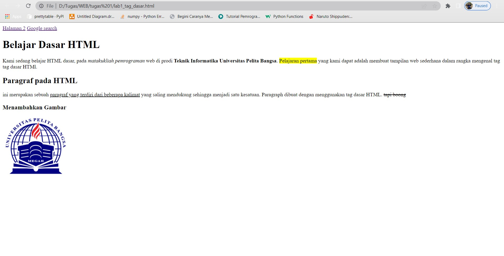

# Tugas pertemuan ke 1
Repository ini digunakan untuk memenuhi Tugas Lab1Web

Nama    : Dani Darmawan
NIM     : 312010154
KELAS   : TI.20.B1 
## 1. Membuat Paragraf

### Hasil


### Mengatur atribut Paragraph
**Penggunaan align Justify dan center**


**Hasil**


**Penjelasan**
**Paragraf Ke 1 Menggunakan "align="justify"**
pada screenshoot yang saya lampirkan memang tidak terlihat perbedaanya dengan
sebeleumnya karna kegunaan "align="justify" sebernya hanya pengatur agar teks dapat rata kanan dan juga kiri
 
 **Paragraf Ke 2 Menggunakan "align="center"**
 sedangkan center terlihat jelas terdapat perubahan yang dimana paragraf berubah posisi  menjadi di tengah

**Penggunaan align left dan right**


**Hasil**


**Penjelasan**
**Paragraf Ke 1 Menggunakan "align="left"**
pada screenshoot yang saya lampirkan memang tidak terlihat perbedaanya dengan
sebeleumnya karna kegunaan "align="left" sebernya hanya pengatur agar teks berada di Kiri
 **Paragraf Ke 2 Menggunakan "align="right"**
 sedangkan center terlihat jelas terdapat perubahan yang dimana paragraf berubah posisi menjadi di bagian kanan

 ## 2. Menambahkan Judul


## Hasil


**Penjelasan**
Dalam Menambahkan Judul kita menggunakan Heading ``` html <h1></h1> <h2></h2> ```
Pembeda <h1> dan <h2> hanya dari ukurannya saja terlihat jelas dari Screenshoot yang telah saya tampilkan.

## 3. Memformat Teks


## Hasil


**Penjelasan**
``` html <i>teks</i> ``` Memiringkan teks (italic)
``` html <b>teks</b> ``` Menebalkan teks (bold)
``` html <mark></mark> ``` Memberi penanda seperti menggunakan stabilo
``` html <u></u> ``` Memberi garis bawah (underline)
``` html <del><del> ``` Mencoret teks

## 4. Menyisipkan Gambar


## Hasil


**Penjelasan**
``` html  ```
``` html src="D:\Tugas\WEB\tugas 1\gambar bahan\1.png"``` memasukan lokasi foto yang  ingin di tampilkan
``` html width="200" height="180" ``` Mengatur ukuran pada foto
``` html tittle="Logo Universitas Pelita Bangsa"``` Memberi nama pada foto 


## 5. Menambahkan Hyperlink


## Hasil


**Penjelasan**
``` html  <nav>
            <a href="lab1_tag_Halaman2.html">Halaman 2</a>
            <a href="http://www.google.com">Google search</a>
        </nav> 
```
``` html <a href="lab1_tag_Halaman2.html"> ``` alamat yang di tuju
    ``` html Halaman 2</a> ``` teks yang akan di tampilkan
    jadinya akan Muncul Halaman 2 dan saat kita klik akan berpindah ke halaman lab1_tag_Halaman2
    Contohnya seperti ini
    

# Jawab Pertanyaan
1. Lakukan perubahan pada kode sesuai dengan keinginan anda, amati perubahannya adakah 
error ketika terjadi kesalahan penulisan tag? <i>Tidak Ada<i>
2. Apa perbedaan dari tag ```html<p>``` dengan tag ```html<br>```, berikan penjelasannya!
 ```html<p>```per paragraf
 ```html<br>``` Pindah baris atau Enter
3. Apa perbedaan atribut title dan alt pada tag ```html```, berikan penjelasannya!
**
4. Untuk mengatur ukuran gambar, digunakan atribut width dan height. Agar tampilan gambar 
proporsional sebaiknya kedua atribut tersebut diisi semua atau tidak? Berikan penjelasannya!
5. Pada link tambahkan atribut target dengan nilai atribut bervariasi ( _blank, _self, _top, _parent ), apa yang terjadi pada masing-masing nilai antribut tersebut?